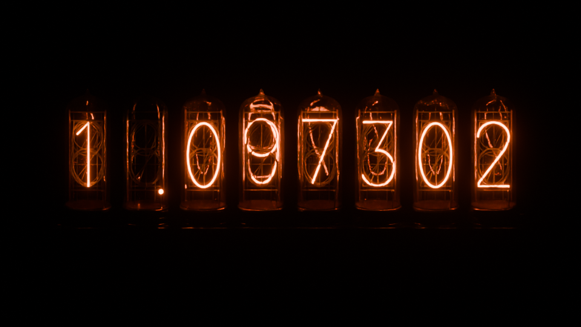
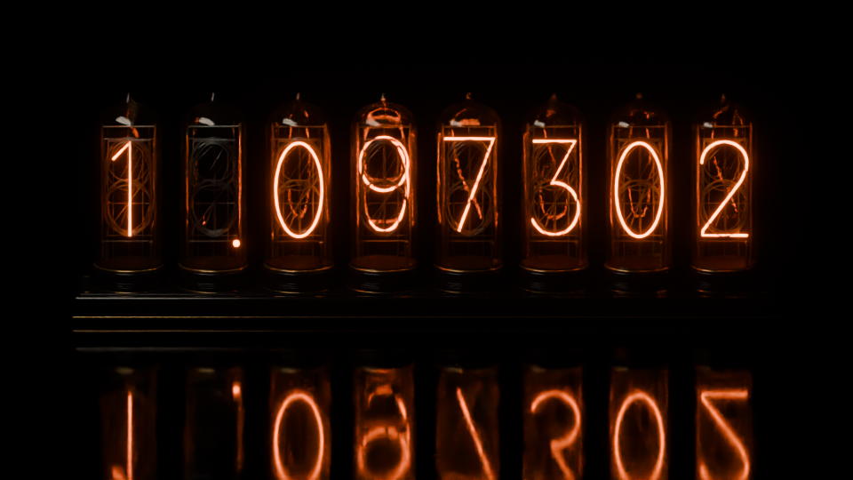
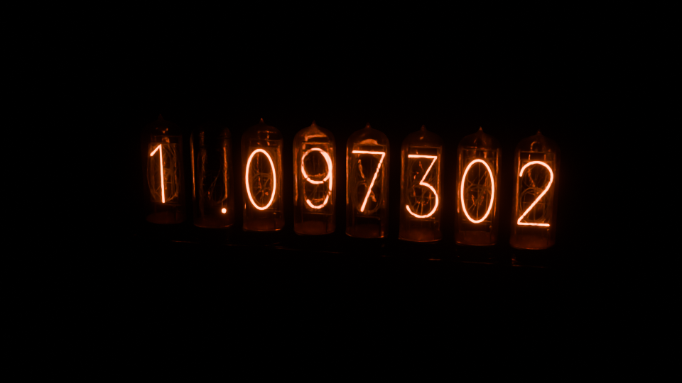
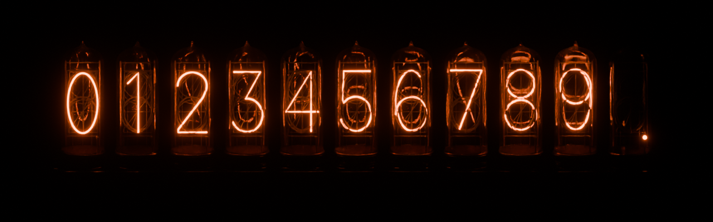

# Divergent Meter Renderer


Create Nixie-tube wallpapers in your browser or with Python and Blender. Choose the digits, position the camera, and adjust the glow, glass, reflections, and lighting.

**[Open the browser editor →](https://hkchengrex.com/divergent-meter-renderer/)**

Each tube contains ten stacked wire numerals and a bottom-right decimal point. One character glows at a time, and each character in your reading occupies a full tube.

The default scene displays `1.097302` at 3840 × 2160, lit entirely by the orange cathodes against a black background. Each render saves:

- A **PNG image** for use as a wallpaper or illustration.
- An **editable Blender scene** for further customization.
- A **JSON settings file** to reuse or share the configuration.

## Compose in the browser, render in Blender

The [browser editor](https://hkchengrex.com/divergent-meter-renderer/) runs locally in your browser. No installation is needed to preview a scene.

1. Enter a reading and adjust the glow, materials, or studio light.
2. Drag the preview to orbit, and scroll to zoom. The camera controls update with your view.
3. Set the output resolution and select **Copy command**.
4. Run the command in a terminal after installing the Python renderer below and setting `BLENDER_PATH`.

You can also select **Download settings JSON** and render it with:

```sh
nixie-render --config nixie-settings.json --output renders/nixie
```

Use **Import settings** to load a configuration from the Python renderer or a previous browser session. **Save preview PNG** downloads the browser image at the selected output resolution, subject to your device's graphics limits.

Enable **High quality** for progressive GPU path tracing. The image refines up to 1,024 samples when you stop editing; moving the camera or changing settings returns to the fast preview and restarts refinement. Initial shader compilation can take tens of seconds or longer depending on your GPU and browser. Denoising reduces grain while the image converges.

In high-quality mode, **Save preview PNG** saves the accumulated image at the preview size shown above it. Use the Blender command for a final render at the selected output resolution.

### What carries over?

Both renderers use the same numeral paths, glass profile, cathode depth order, bottom-right dot position, and spacing. Camera coordinates, framing, and every exported setting use the Python renderer's conventions. The Blender renderer remains available independently through its CLI and Python API.

The fast preview uses local lights to approximate light emitted by the cathodes, and screen-space effects for glass and floor reflections. High-quality mode traces light through glass with actual wall thickness and uses the glowing cathodes themselves as light sources. It is closer to Blender's lighting, but materials, denoising, and glow still differ from Cycles; fine detail can look softer. Preview calibration does not change exported settings. The samples and seed fields affect Blender only.

For a quick final-look check, render the downloaded settings at a smaller size:

```sh
nixie-render --config nixie-settings.json --width 960 --height 540 --samples 24 --output renders/check
```

## Requirements and installation

- Python 3.10+ with no third-party runtime dependencies.
- Blender 5.2+ installed separately. Tested with Blender 5.2 on Windows; rendering uses Cycles on CPU.
- No `bpy` installation is needed in your regular Python environment.

Clone the repository and install:

```sh
git clone https://github.com/hkchengrex/divergent-meter-renderer.git
cd divergent-meter-renderer
python -m pip install .
```

Or run `python -m nixie_renderer` directly from this folder without installation.

Set `BLENDER_PATH` to the Blender executable, put Blender on `PATH`, or pass `--blender` each time. PowerShell example:

```powershell
$env:BLENDER_PATH = 'C:\Program Files\Blender Foundation\Blender 5.2\blender.exe'
python -m nixie_renderer --reading 1.097302 --output renders/wallpaper
```

On macOS a typical executable is `/Applications/Blender.app/Contents/MacOS/Blender`; on Linux it is usually `blender` on `PATH`.

Start with a quick preview before rendering 4K:

```sh
nixie-render --reading 0.123456 --width 960 --height 540 --samples 24 --output renders/preview
nixie-render --reading 1.097302 --width 3840 --height 2160 --samples 96 --output renders/final
```

Start with a low-resolution preview to adjust the composition, then increase resolution and samples for the final image. Higher sample counts reduce noise and increase render time.

## Render gallery: commands and results

Try the commands below to create each look. Set `BLENDER_PATH` first, as shown above. The examples use 24 samples at preview resolution; use `--width 3840 --height 2160 --samples 96` for 4K. Add `--overwrite` to replace an existing render.

### 1. Dark, cathode-only lighting

Only the glowing digits illuminate the glass and hardware. The decimal occupies its own full tube, with the complete unlit numeral stack still inside it.

```sh
nixie-render --reading 1.097302 --width 960 --height 540 --samples 24 --output renders/dark
```


### 2. Brighter glow and a stronger halo

Increase the light emitted by the digits with `--brightness`. Lower `--bloom-threshold` to add a stronger halo around the glow.

```sh
nixie-render --reading 1.097302 --width 960 --height 540 --samples 24 --brightness 40 --bloom-threshold 0.7 --output renders/brighter
```



### 3. Glossy floor and directional studio lighting

Use both `--reflection` and low `--floor-roughness` for a clear floor reflection. The area light points from `--studio-position` toward `--studio-target`; its dimensions control highlight softness. A lower camera target leaves more room for the reflection.

```sh
nixie-render --reading 1.097302 --width 960 --height 540 --samples 24 --reflection 0.8 --floor-roughness 0.06 --studio-brightness 150 --studio-position -4 -3 6 --studio-target 0 0 1 --studio-size 5 --studio-size-y 2 --camera-position 0 -15 4.22 --camera-target 0 0 0.7 --output renders/glossy-studio
```



For a dark background without a floor reflection, use `--reflection 0 --studio-brightness 0 --ambient-brightness 0`.

### 4. Perspective camera and softer glass highlights

Move the camera sideways and switch to perspective to show the depth of the meter. Increase glass roughness slightly and reduce glass specular strength for softer highlights. This example remains lit only by the cathodes.

```sh
nixie-render --reading 1.097302 --width 960 --height 540 --samples 24 --camera-type PERSP --camera-position 3 -14 5 --camera-target 0 0 1.13 --focal-length 45 --glass-roughness 0.12 --glass-reflection 0.15 --output renders/perspective
```



### 5. All digits and the decimal point

`--atlas` selects `0123456789.`. Each of the eleven tubes contains the same cathode geometry, with a different character activated.

```sh
nixie-render --atlas --width 1280 --height 400 --samples 24 --output renders/atlas
```



To regenerate every image in this README, including the saved scenes and settings under `renders/gallery/`:

```sh
python examples/render_gallery.py
```

The script overwrites previous gallery renders. Pass `--blender /path/to/blender` if Blender is not on your `PATH`.

## Python API

```python
from nixie_renderer import RenderConfig, render

config = RenderConfig(
    reading="1.097302",  # keep this a string, including any leading zeros
    width=1920,
    height=1080,
    samples=64,
    brightness=24,
    camera_position=(3, -15, 5),
    camera_target=(0, 0, 1.13),
    reflection=0.7,
    floor_roughness=0.08,
    glass_roughness=0.1,
    glass_reflection=0.2,
    studio_brightness=60,  # watts; use 0 for cathode-only illumination
    studio_position=(-4, -3, 6),
    studio_target=(0, 0, 1),
)
paths = render(config, "renders/custom", blender="/path/to/blender")
print(paths["png"])
config.save("my-settings.json")
```

`render()` launches Blender in the background, waits for it to finish, and returns a dictionary of output paths. For example, `"renders/custom"` produces `custom.png`, `custom.blend`, and `custom.json` in the `renders` directory.

Use `scene_only=True` to save the scene and settings without rendering an image. To replace existing files, pass `overwrite=True` in Python or `--overwrite` on the command line.

To build a scene directly inside Blender, import `build_scene` from `nixie_renderer.scene` and call `build_scene(config)`. **This clears the current scene**, so use a new Blender session. The `render()` API above uses a separate process and leaves open Blender sessions untouched.

## Camera and lighting coordinates

- X: left/right along the row. Z: up. The default camera looks from negative Y toward the tubes.
- `camera_position` controls viewpoint; `camera_target` controls where it points.
- `ORTHO` preserves parallel lines. `camera_scale` controls framing, not distance. `null` automatically fits the front-view row and aspect ratio. Oblique views may need manual adjustment.
- `PERSP` uses `focal_length` in millimeters; change camera distance to fit the row. Orthographic scale has no effect in perspective mode.
- Studio light direction is **from `studio_position` toward `studio_target`**. The light is a rectangular area light. Larger sizes soften its highlights.
- With `studio_brightness=0` and `ambient_brightness=0`, cathodes are the only light source. The dot tube is naturally darker because its emitter is smaller.

## Controls

Every setting below is available in JSON, as a `RenderConfig` field, and as a CLI flag using hyphens instead of underscores. Vector flags take three numbers. `--no-bloom` disables bloom.

| Settings | Meaning / defaults |
| --- | --- |
| `reading` | String of 1–64 characters from `0123456789.`; default `1.097302` |
| `width`, `height`, `samples` | PNG resolution and Cycles samples; 3840, 2160, 96 |
| `brightness`, `glow_color` | Cathode emission strength 18; linear RGB `(1, .115, .008)` |
| `exposure` | Image exposure in stops; 0. This changes the image, not emitted light |
| `bloom`, `bloom_threshold` | Compositor halo enabled; threshold 1.4 |
| `camera_position`, `camera_target` | `(0,-15,4.65)`, `(0,0,1.13)` |
| `camera_type`, `camera_scale`, `focal_length` | `ORTHO`, automatic (`null`), 50 mm |
| `reflection` | Floor specular control 0–1; 0 disables floor reflections |
| `floor_roughness` | 0–1; lower gives sharper reflections. Default 1. Set both reflection and roughness for glossy floors |
| `glass_roughness` | 0–1; default .085. Higher values soften highlights but can blur the view through glass |
| `glass_reflection` | Principled specular IOR level 0–1; default .22. Not an exact reflectance percentage |
| `glass_ior` | Refraction index, default 1.46; minimum 1 |
| `base_roughness` | Base material roughness 0–1; default .17. Controls the enclosure beneath its clearcoat |
| `studio_brightness` | Area-light power in Blender watts, default 0 (off) |
| `studio_position`, `studio_target` | `(-4,-3,6)`, `(0,0,1)` |
| `studio_color` | Linear RGB `(1,.85,.65)`, each component 0–1 |
| `studio_size`, `studio_size_y` | Rectangular emitter dimensions, 5 and 2 scene units |
| `ambient_brightness` | World illumination strength, default 0 |
| `seed` | Cycles sampling seed, default 0 |

Material roughness is the inverse of perceived glossiness. To reduce distracting highlights while retaining clear glass, lower studio brightness, enlarge the area light, or reduce `glass_reflection` before greatly increasing glass roughness.

## JSON presets and CLI overrides

```sh
nixie-render --config examples/studio-glossy.json --output renders/studio
nixie-render --config examples/studio-glossy.json --reading 2.000001 --studio-brightness 20 --output renders/variant
nixie-render --config examples/dark-4k.json --write-config resolved-settings.json
nixie-render --reading 1.097302 --scene-only --output renders/editable
nixie-render --atlas --width 3840 --height 1280 --output renders/atlas
```

JSON files can contain just the fields you want to change. Missing fields use defaults, and command-line flags override the JSON values. The settings file saved beside each render contains the complete configuration.

For example, save this as `settings.json`:

```json
{
  "reading": "0.123456",
  "brightness": 24,
  "glass_reflection": 0.15,
  "width": 1920,
  "height": 1080
}
```

```sh
nixie-render --config settings.json --output renders/custom
```

The Blender file also includes the configuration in a `nixie-config.json` text block, accessible from Blender's Text Editor.

## Run the browser editor locally

With Node.js 24 and pnpm installed, run these commands from the repository root:

```sh
pnpm --dir web install
pnpm --dir web dev
```

Open the local address printed in the terminal. To create a static build for hosting:

```sh
pnpm --dir web build
```

The site is written to `web/dist`. The included GitHub Actions workflow publishes that build to GitHub Pages when changes reach `main`. For a fork, select **GitHub Actions** under **Settings → Pages → Build and deployment**. The Python renderer does not require Node.js or the browser editor.
